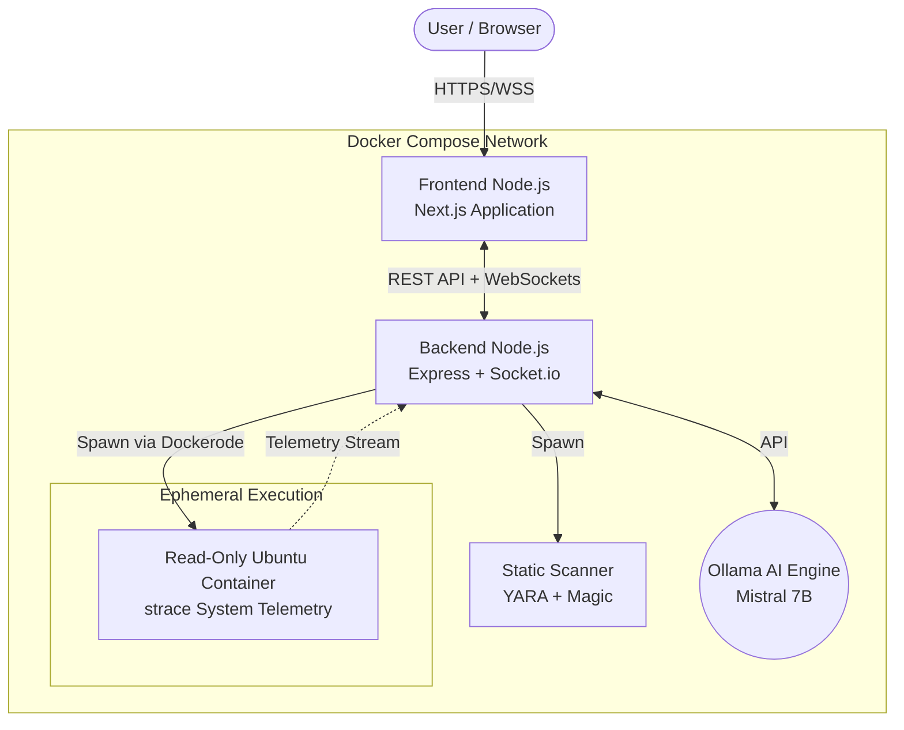

# Scholar Sandbox

Scholar Sandbox is a controlled, educational malware analysis environment developed for students and cybersecurity researchers. The platform enables the safe deconstruction and execution of suspicious payloads without risking the host machine's integrity.

By combining Static Analysis, Dynamic Analysis via sandboxing, and Generative AI, Scholar Sandbox provides a comprehensive and accessible breakdown of potential threats and low-level system interactions.

---

## Architecture

The project employs a microservices architecture orchestrated via Docker Compose.




### Components

1. **Frontend (`/frontend`)**: Next.js 14 application providing a realtime telemetry dashboard and WebSocket streaming capabilities.
2. **Backend Engine (`/backend`)**: Node.js and Express server responsible for API routing, Dockerode integration for dynamic container spinning, and WebSocket broadcast.
3. **Static Scanner (`/scanner`)**: Python 3 engine utilizing `python-magic` for accurate file typing and `yara-python` for rule-based static malware detection.
4. **Sandbox Box (`/sandbox`)**: A heavily restricted, read-only `ubuntu:22.04` Docker image pre-installed with `strace`. It executes the payload and logs system calls unconditionally.
5. **AI Pipeline (`/ai`)**: Python 3 scripts utilizing the Ollama SDK to query a locally hosted Mistral 7B model, translating raw telemetry into readable threat intelligence.

---

## Prerequisites

Ensure the deployment host meets the following requirements:

1. **Docker Engine**: Installed and running.
2. **Docker Compose Plugin**: Required for service orchestration.
3. **Local Storage**: Minimum 5GB free space for the Ollama Mistral model weights.

*Note: The backend service requires access to the host's `/var/run/docker.sock` to dynamically provision and tear down ephemeral sandbox containers.*

---

## Installation & Deployment

1. **Clone the repository:**
   ```bash
   git clone https://github.com/shivajirathod007/Scholar-Sandbox.git
   cd Scholar-Sandbox
   ```

2. **Initialize the Docker Cluster:**
   This command builds the frontend and backend Node.js images, and provisions the Ollama database volume.
   ```bash
   docker compose --profile ollama up --build -d
   ```

3. **Install the AI Model Pipeline:**
   The Ollama image is deployed empty. You must download the Mistral 7B weights. Run this command while the cluster is running:
   ```bash
   docker exec scholar-sandbox-ollama-1 ollama pull mistral
   ```
   *(This downloads approximately 4.4GB of weights. This operation is only required once).*

---

## Operation Instructions

Once the cluster is initialized and the model is pulled:

1. Navigate to `http://localhost:3000` in a supported web browser.
2. Upload a permitted file type (e.g., executable, script, or document) into the drop zone.
3. Monitor the Live Execution Feed for realtime static and dynamic analysis events.
4. Upon completion, review the Threat Intelligence Report for the AI-generated vulnerability assessment.

### Lifecycle Management

- **Suspend Operation**: To stop the services cautiously without data loss:
  ```bash
  docker compose stop
  ```

- **Resume Operation**: To spin the cluster back up from a suspended state:
  ```bash
  docker compose start
  ```

- **Full Teardown**: To completely destroy the cluster networking and container instances (AI weights will persist in the volume):
  ```bash
  docker compose down
  ```

---

## Hardware Configuration & Benchmarks

### Running Without a GPU (CPU Mode)
Ollama will automatically fall back to CPU if no compatible AMD/NVIDIA GPU is detected or passed through Docker. 
- Expect **~30–60 seconds** for AI inference instead of ~5 seconds.
- No additional configuration or code change is needed.

### AMD ROCm Acceleration (Ideathon Demo)
If presenting this project where AMD hardware acceleration is evaluated:
- **CPU (i5/Ryzen 5)**: ~45 seconds inference
- **AMD RX 7600 (ROCm)**: ~4.8 seconds inference
*(Source: Ollama community benchmarks)*

*Note: For live Ideathons without discrete GPUs, it is standard practice to use pre-cached JSON responses simulating the ROCm pipeline speed.*

---

## Security Advisories & Limitations

**UNSUPPORTED FOR PRODUCTION USAGE**

Consider the following critical security limitations:
- The backend mounts the host Docker socket (`/var/run/docker.sock`). A compromise of the backend Node.js server theoretically allows sandbox escapes granting root access to the host machine.
- This project is strictly designed for local, educational, and controlled research environments. Do not expose the dashboard or backend API to the open internet.

## License

See the `LICENSE` file for more details.
